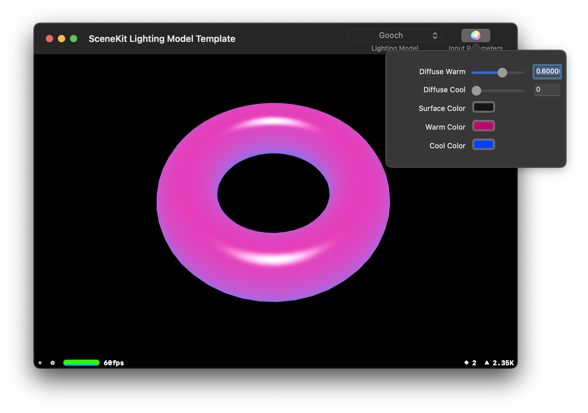

scenekit-lighting-models
========================

Alternate lighting models using custom SCNProgram for SceneKit

A demo app for previewing alternate lighting models using a custom SCNProgram with SceneKit. Based on a Quartz Composer conversion of NVIDIA samples from toneburst([machinesdontcare.wordpress.com](http://machinesdontcare.wordpress.com)). 

A [short video](https://vimeo.com/106634143) of the app in action.

